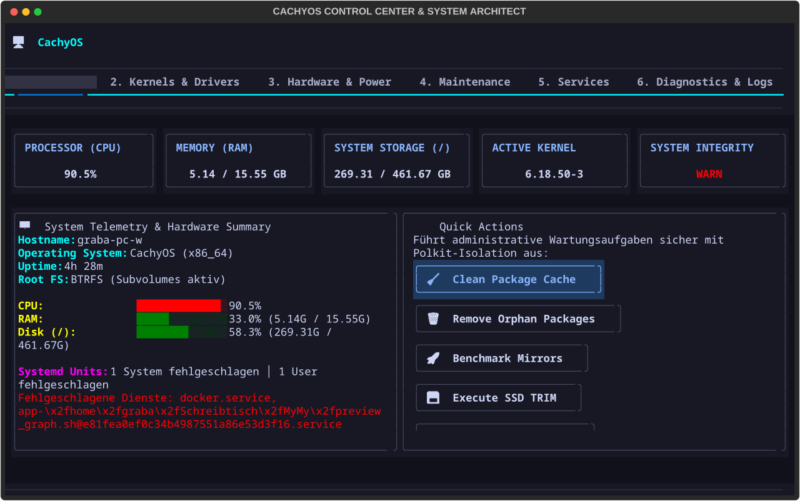
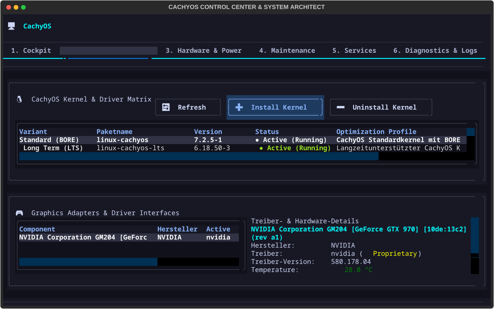
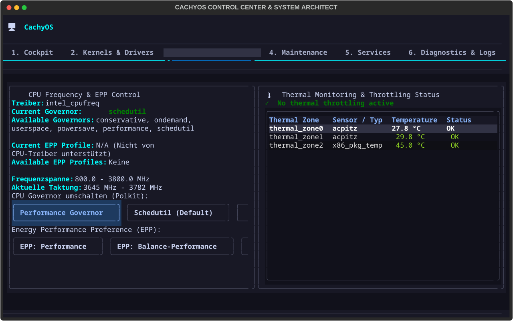
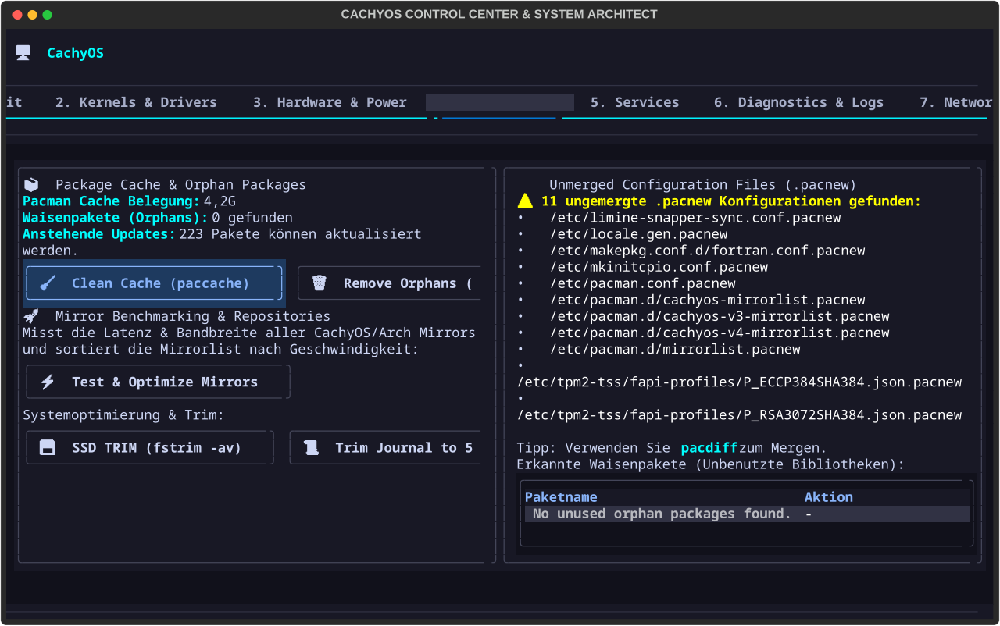
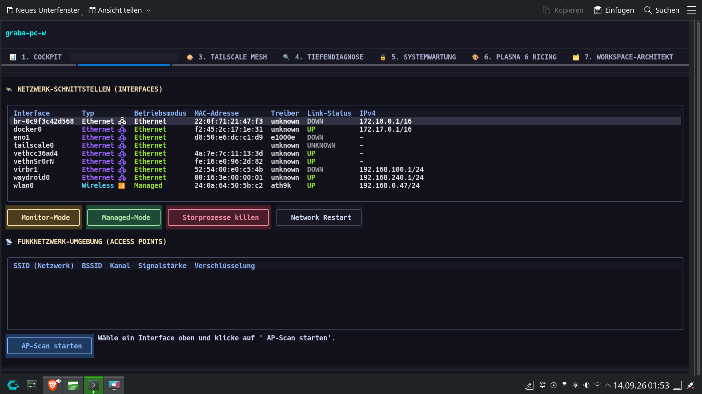

[🇩🇪 Zur deutschen Dokumentation wechseln](README_DE.md) | [🇬🇧 Switch to English Documentation](README.md)

# ⚡ CachyOS Control Center & Unified System Administrator

[](https://github.com/Graba92/cachyos-control-center)
[](https://cachyos.org)
[](https://python.org)
[](https://textual.textualize.io)
[](LICENSE)
[](CHANGELOG.md)

<p align="center">
  
</p>
<p align="center">
  
</p>
<p align="center">
  
</p>
<p align="center">
  
</p>
<p align="center">
  
</p>

Ein hochperformantes, modulares Terminal User Interface (TUI) Dashboard und Headless-Automatisierungswerkzeug, maßgeschneidert für **CachyOS und Arch Linux**.

---

## 🌟 Kernmodule & Funktionsumfang

### 1. 🐧 Kernel- & Treibermanagement
- **Kernel-Matrix:** Zeigt den laufenden Kernel, installierte Varianten und alle verfügbaren CachyOS-Kernel im Repository an (`BORE`, `Clang LTO`, `PREEMPT_RT`, `BMQ`, `LTS`, `Server`, `RC`).
- **Live-Statusindikatoren:** Eindeutige Status-Badges (`Aktiv (Laufend)`, `Installiert`, `Verfügbar`).
- **GPU-Hardwarematrix:** Erkennt NVIDIA-, AMD- und Intel-Karten, prüft aktive Treiber (proprietär vs. Open-Source), Watt-Verbrauch, Temperatur und Power-States (`nvidia-smi` / sysfs DPM).
- **Sichere Kernel-Aktionen:** Unprivilegiertes Installieren und Entfernen von Kernel-Varianten mit modularer Polkit-Authentifizierung.

### 2. ⚡ Hardware- & Power-Profile
- **CPU Scaling Governors:** Frequenzüberwachung aller Kerne mit 1-Klick-Umschaltung des Governors (`performance`, `schedutil`, `powersave`, `ondemand`, `conservative`).
- **Energy Performance Preferences (EPP):** Schnelles Umschalten zwischen `performance`, `balance_performance` und `power`.
- **Thermisches Monitoring & Drosselschutz:** Kontinuierliche Überwachung aller Thermal-Zonen (`/sys/class/thermal/`), Erkennung passiver Trip-Points und Hardware-Drosselung ohne Fehlalarme.

### 3. 🧹 Systemwartung & Repository-Hygiene
- **Mirror-Benchmarking:** Integriertes Benchmarking mittels `cachyos-rate-mirrors` oder `rate-mirrors` zur automatischen Ermittlung der schnellsten Spiegelserver.
- **Paket-Cache Bereinigung:** Gibt Festplattenspeicher frei via `paccache -r -k 2` oder `pacman -Sc` mit vorheriger Größenberechnung.
- **Waisenpakete entfernen:** Erkennt ungenutzte Abhängigkeiten (`pacman -Qtdq`) und entfernt sie restlos (`pacman -Rns`).
- **Pacnew-Auditor:** Prüft `/etc` auf ungemergte `.pacnew`-Konfigurationsdateien.
- **SSD TRIM & Journal-Vakuum:** 1-Klick SSD-TRIM (`fstrim -av`) und Beschränkung des systemd-Journals auf 50MB.
- **Pacman-Lock Schutz:** Automatische Erkennung von `/var/lib/pacman/db.lck` zur Vermeidung von Datenbankkonflikten.

### 4. ⚙️ Systemd Diensteverwaltung
- **Live Daemon Monitoring:** Überwacht zentrale Dienste wie `NetworkManager`, `bluetooth`, `tailscaled`, `sshd`, `ananicy-cpp`, `systemd-resolved`, `ufw`/`firewalld`, `docker` und `syncthing`.
- **Granulare Steuerung:** Starten, Stoppen, Neustarten, Aktivieren und Deaktivieren direkt über Polkit.

### 5. 🔍 Tiefendiagnose & Boot-Auditing
- **Boot-Parameter:** Saubere Anzeige und Formatierung der aktiven Kernelzeile (`/proc/cmdline`).
- **Systemd-Analyze:** Detaillierte Bootzeit-Analyse (Firmware, Loader, Kernel, Initrd, Userspace).
- **Kernel-Log Feed:** Live-Auszug der Kernel-Logs über `journalctl -k` / `dmesg`.
- **Hardware-Snapshot:** CPU-Architektur, Mainboard-Modell, Festplatten und PCI-Controller.
- **Netzwerk-Zustandsprüfung:** Gateway-Latenz, DNS-Auflösung und HTTP 204 Internetprüfung.

### 6. 🌐 Zweisprachige Lokalisierung (i18n) & Privileg-Isolation
- **Zweisprachig:** Vollständige Unterstützung für Deutsch (`de_DE`) und Englisch (`en_US`). Jederzeit zur Laufzeit umschaltbar mit Taste `L`.
- **Strikte Privileg-Isolation:** Die TUI läuft unprivilegiert als regulärer Benutzer. Root-Aktionen werden isoliert via Polkit (`org.cachyos.controlcenter.policy`) ausgeführt.
- **Hochkontrast-Typografie:** Optimiertes TCSS Tabs-Styling mit scharfem Kontrast zur Verhinderung von Farbverwaschungen bei fokussierten Tabs.
- **XDG-Standard:** Konfigurationsspeicherung unter `~/.config/cachyos-control-center/config.toml` bzw. `/etc/cachyos-control-center/config.toml`.

---

## 🏛️ Architektur & Dateistruktur

```text
cachyos-control-center/
├── app.py                             # Universeller CLI- & TUI-Einstiegspunkt
├── cachyos_center.py                  # Textual TUI Master Application (7 Tabs)
├── setup.sh                           # Automatischer Installationsprüfer
├── run.sh                             # 1-Klick Starter
├── PKGBUILD                           # Arch/CachyOS PKGBUILD Paketmanifest
├── config.example.toml                # XDG-Konfigurationsvorlage
├── requirements.txt                   # Python-Abhängigkeiten (textual, rich)
├── CHANGELOG.md                       # Release-Notes (v1.0.1)
│
├── core/                              # System- & Geschäftslogik
│   ├── i18n.py                        # Zweisprachige Übersetzungs-Engine (DE / EN)
│   ├── config.py                      # XDG-konforme Konfigurationsverwaltung
│   ├── polkit.py                      # Privileg-Isolation & pkexec Dispatcher
│   ├── kernel_driver.py               # CachyOS Kernel-Matrix & GPU-Treiberprüfer
│   ├── hardware_power.py              # CPU-Governors, EPP-Profile & Thermals
│   ├── maintenance.py                 # Mirror-Benchmarking, Cache & Waisenbereinigung
│   ├── system.py                      # Hardware-Telemetrie & Systemd-Auditor
│   ├── diagnostics.py                 # Boot-Parameter, Logs & JSON-Audit-Engine
│   ├── network.py                     # WLAN-Schnittstellen & AP-Scanner
│   └── tailscale.py                   # Tailscale Mesh-Topologie & Routing
│
├── ui/                                # Textual Benutzeroberfläche
│   ├── theme.py                       # Catppuccin Mocha / CachyOS Emerald Stylesheet
│   └── screens/                       # Modulare Screen-Komponenten
│       ├── dashboard_view.py          # Cockpit mit Live-Telemetrie & Schnellaktionen
│       ├── kernel_view.py             # Kernel-Matrix & GPU-Treibermanagement
│       ├── power_view.py              # CPU-Governor, EPP & Thermal-Monitoring
│       ├── maint_view.py              # Mirror-Ranking, Cache-Cleaning & .pacnew
│       ├── services_view.py           # Systemd Dienste-Steuerung
│       ├── diag_view.py               # Boot-Cmdline, Kernel-Logs & Analyse
│       ├── wifi_view.py               # WLAN-Schnittstellenprüfung
│       └── tailscale_view.py          # WireGuard Mesh-Status
│
├── data/                              # Desktop- & Sicherheitsdateien
│   ├── org.cachyos.controlcenter.policy  # Polkit-Regeln
│   ├── cachyos-control-center.desktop    # XDG Anwendungsstarter
│   └── cachyos-control-center.svg        # Vektor-Anwendungsicon
│
└── bin/                               # Standalone Hilfswerkzeuge
    ├── net_diagnose.py                # Standalone Netzwerkdiagnose
    └── agy_migrator.py                # Verzeichnis-Synthesizer
```

---

## 💻 CLI & Headless-Automatisierung

`cachyos-control-center` unterstützt vollständige Skript- und Terminalintegration:

```bash
# 1. Systemübersicht im Terminal (CPU, RAM, Kernel, GPUs, Updates)
./app.py --status

# 2. Autonome Headless-Systemhygiene (leert Cache, entfernt Waisen, führt TRIM aus)
./app.py --clean

# 3. Vollständiger Systemaudit als strukturiertes JSON
./app.py --json

# 4. Schnelle Netzwerk- & Latenzdiagnose
./app.py --diag quick

# 5. Standardsprache festlegen
./app.py --lang de   # Deutsch
./app.py --lang en   # Englisch
```

---

## 📦 Installation

### Option 1: Direkte AUR-Installation (Arch Linux / CachyOS)

```bash
# Über yay
yay -S cachyos-control-center

# Über paru
paru -S cachyos-control-center

# Oder manuell kompilieren via makepkg
git clone https://github.com/Graba92/cachyos-control-center.git
cd cachyos-control-center
makepkg -si
```

### Option 2: Schnelle lokale Installation

```bash
git clone https://github.com/Graba92/cachyos-control-center.git
cd cachyos-control-center
chmod +x setup.sh run.sh
./setup.sh
./run.sh
```

---

## ⌨️ Tastatur-Navigation

| Taste | Aktion |
|:---:|:---|
| `1` | **Cockpit:** Telemetrie-KPIs & Schnellaktionen |
| `2` | **Kernel & Treiber:** CachyOS Kernel-Matrix & GPU-Adapter |
| `3` | **Hardware & Power:** CPU-Governors, EPP-Profile & Thermals |
| `4` | **Wartung:** Mirror-Benchmarking, Cache-Bereinigung & Waisen |
| `5` | **Dienste:** Systemd Diensteverwaltung |
| `6` | **Diagnose:** Boot-Parameter, Kernel-Logs & Hardware-Snapshot |
| `7` | **Netzwerk:** WLAN & Tailscale Mesh |
| `L` | **Sprachwechsel:** Dynamisch zwischen Deutsch und Englisch wechseln |
| `R` | **Aktualisieren:** Telemetrie und Daten des aktiven Tabs neu laden |
| `Q` | **Beenden:** Control Center schließen |

---

## 📄 Lizenz

Veröffentlicht unter der **MIT Lizenz**. Siehe [LICENSE](LICENSE) für Details.  
Entwickelt und gepflegt von **Matthias Haase (@Graba92)**.
